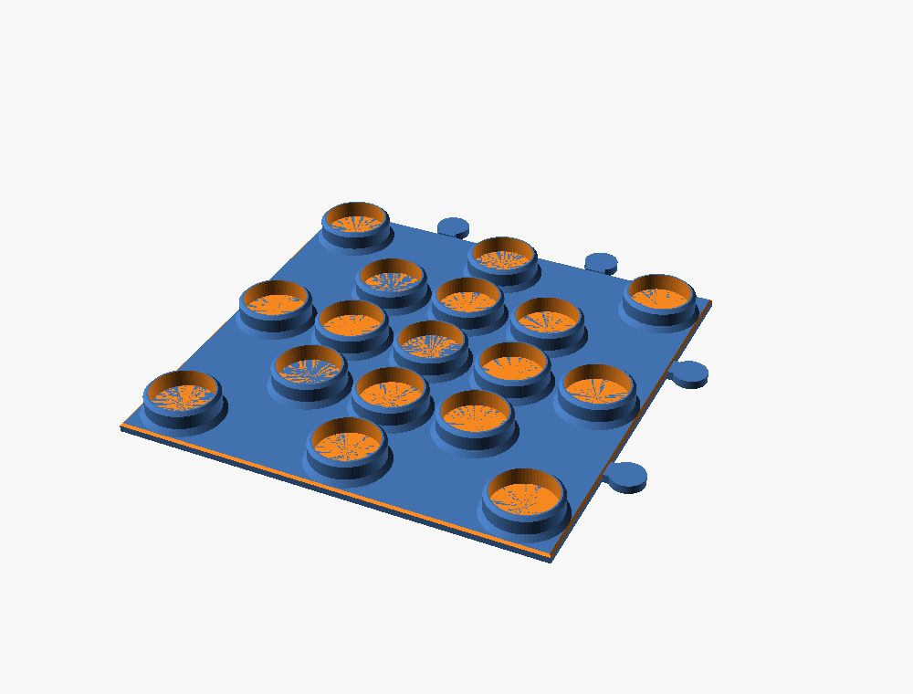
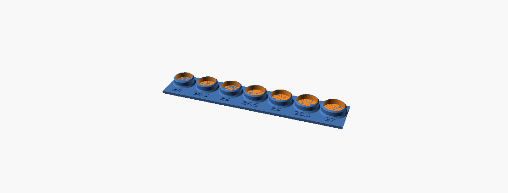

# marble_run_models

3D-printable models for translucent OEM marble runs (National Geographic
and similar). Parametric OpenSCAD source plus ready-to-slice STLs.

## Base plate

A tileable base plate that gives marble-run stacks a stable footing. A
grid of hollow pegs plugs into the open (cup) end of the tubes the same
way the tubes' own male spigots plug into each other, so vertical columns
can't tip. Plates interlock edge-to-edge and the peg grid stays continuous
across the seams, so horizontal pieces can span two tiles.

| File | Description |
|------|-------------|
| `src/marble_run_baseplate.scad` | Parametric source (edit this) |
| `stl/marble_run_baseplate_5x5.stl` | 5×5 tile, 162×162×11mm |
| `stl/marble_run_calibration.stl` | Fit tester — **print this first** |

### Calibrate before printing tiles

Peg diameter depends on your exact tubes and can't be eyeballed. Print the
calibration strip (test pegs 24.0–27.0mm, labeled), push a real tube's cup
end onto each, and pick the snug one. Set `peg_od` to that value in the
`.scad`, re-export, then print tiles.

### Print settings (Bambu)

Prints flat, pegs up, **no supports**.

- Material: PLA (easy) or PETG (tougher, better snap)
- Layer height: 0.2mm · Walls: 3–4 · Infill: 15–20%
- Brim: 5mm to prevent corner lift

### Key parameters

| Parameter | Purpose |
|-----------|---------|
| `peg_od` | Peg diameter — the fit into your tubes (calibrate) |
| `pitch` | Grid spacing — match your set's module (default 30mm) |
| `grid_x`, `grid_y` | Pegs per tile |
| `peg_h` | Peg height / grip depth |
| `tab_tol` | Tightness of the plate-to-plate joint |

## License

MIT — see [LICENSE](LICENSE). (Swap for CC-BY or remove if you'd rather.)
